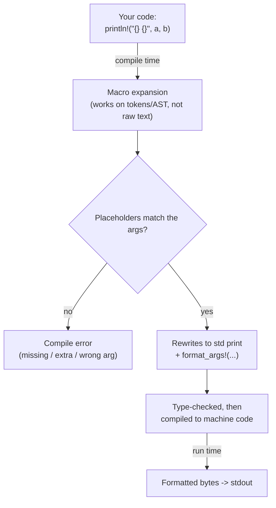

# Note · `println!` is a macro (compile-time formatting)

*Concept companion for [`01_hello.rs`](01_hello.rs) — "why the `!`, and why a macro?" · indexed in the [Rust Notebook](../Notebook.md) under "Concept notes".*

## TL;DR
`println!` looks like a function call, but the trailing `!` marks it a **macro**: the compiler **expands** it *before* your program runs, parsing the format string (e.g. `println!("{} {}", a, b)`) and checking that the `{}` placeholders line up with the arguments **at compile time**. A mismatch is a *compile error*, never a runtime crash. A plain function couldn't do this — Rust functions aren't variadic (outside `extern "C"`), and a function can't inspect a string literal while it compiles.

## What actually happens

The key beat: the **diamond happens during compilation**. By the time the program runs, formatting is already settled and inlined — there is no format-string interpreter at runtime, so it is both safe *and* zero-cost.

## Why not just a function?
- **Variadics** — `println!("{}", a)` and `println!("{} {}", a, b)` take different arg counts; a Rust `fn` has a fixed signature (no `...` except `extern "C"` FFI).
- **Compile-time checking** — a macro sees the literal format string as tokens, so it can verify placeholders ↔ args as it compiles. A function only receives already-evaluated values, the string long gone.
- **Zero-cost** — expansion generates the exact formatting code inline; nothing re-parses `"{} {}"` at runtime.

## Analogies
| Lang | Printf-style call | When are format & args checked? |
| --- | --- | --- |
| **Rust** | `println!("{} {}", a, b)` *(macro)* | **compile time** ✅ |
| **C# (tier 1)** | `Console.WriteLine($"{a} {b}")` *(interpolation)* | compile time ✅ — but `string.Format("{0}", a)` is checked at **runtime** |
| **C (tier 2)** | `printf("%d %s", a, s)` | **not checked** — wrong type is undefined behaviour; only `-Wformat` *warns* |
| **Python (tier 2)** | `print(f"{a} {b}")` / `"{}".format(a)` | runtime |

So Rust's macro buys you C#-interpolation-level safety (caught while compiling), but — unlike C's `printf` — it is *guaranteed*, and — unlike Python — it is not deferred to runtime.

## See also
- The Rust Book, ch. 19.6 "Macros" — https://doc.rust-lang.org/book/ch19-06-macros.html
- `std::fmt` (the formatting machinery) — https://doc.rust-lang.org/std/fmt/
- `println!` macro docs — https://doc.rust-lang.org/std/macro.println.html
