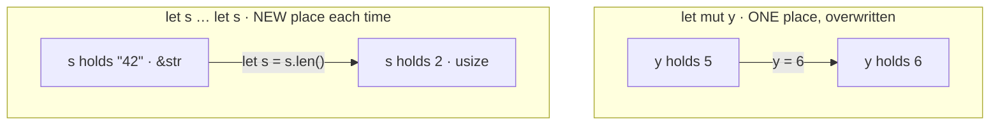

# Note · Naming values — `let`, `let mut`, shadowing, `const`

*Concept companion for [`02_variables.rs`](02_variables.rs) — "mut vs shadowing vs const, really?" · indexed in the [Rust Notebook](../Notebook.md) under "Concept notes".*

## TL;DR
Rust gives you a few ways to bind a name to a value, separated by two questions: **may the name be reassigned?** and **when is the value known — compile time or run time?** `let` is an immutable binding; `let mut` is a mutable binding (same slot, overwritten in place); **shadowing** is a *fresh* `let` that reuses the name (a brand-new slot, and the type may change); `const` is a compile-time constant that is inlined at every use site and always needs a type.

## `mut` vs shadowing — same place, or a new one?

`mut` keeps **one** binding (one typed place) and writes a new value into it — so the type can't change. Shadowing introduces a **new** binding that happens to share the name; because it is a fresh place, the new value may have a **different type** (`&str` → `usize`). That is why `let s = s.len();` is legal but `let mut s = "42"; s = s.len();` is not.

Caveat: "different place" is the *language* model (the abstract machine), not a promise about RAM. For simple scalars LLVM keeps everything in registers and freely reuses or elides slots — so reason about *bindings*, not physical addresses.

## `let` (immutable) vs `const`
| | immutable `let` | `const` |
| --- | --- | --- |
| Value known | **run time** (can be computed: `let n = read()?;`) | **compile time** only (const-evaluated) |
| Lives where | a place on the stack, local to its block | no fixed address — **inlined** at each use (an address is materialised only if you take `&`) |
| Type annotation | optional (inferred) | **mandatory** |
| Scope | inside a fn body | anywhere, incl. module / global |
| Reassignable | no (unless `let mut`) | never |
| Name style | `snake_case` | `SCREAMING_SNAKE_CASE` |

So an immutable `let` means *"a real value sitting somewhere that I promise not to reassign,"* while a `const` means *"a named literal the compiler pastes in wherever I use it."* Both are immutable; only `const` is guaranteed compile-time and storage-free.

## Why must `const` have a type, but `let` often mustn't?
Rust performs type **inference only inside function bodies**. A `const` is an **item** (like `static`, `fn` signatures, and struct fields) — it can sit at module level and be referenced across the whole crate — and items never infer; you spell the type out. A `let` lives in a fn body where local inference applies, so its type is usually optional. (And since a `const` is inlined rather than stored, there is no single initializer slot the compiler could infer a type *from*, the way it can for a `let`.)

## Analogies
| concept | Rust | C# (tier 1) | C / Python (tier 2) |
| --- | --- | --- | --- |
| **compile-time constant** (inlined, type required) | `const MAX: u32 = 100;` | `const int Max = 100;` — also compile-time & inlined | C: `#define MAX 100` or `const int`; Python: `MAX = 100` (UPPER by convention only, **not enforced**) |
| **immutable binding** (value may be computed at run time) | `let max = compute();` | `var max = Compute();` then never reassign (or a `readonly` field) | assign-once by discipline (no real local immutability) |
| **mutable binding** | `let mut max = 0;` | `var max = 0;` | `int max = 0;` / `max = 0` |

C#'s `const` is the cleanest tier-1 match for Rust's `const`: compile-time, inlined, type spelled out. C#'s `static readonly` is the *runtime-initialised* constant — that's closer to Rust's `static`, not `let`.

## See also
- The Rust Book, ch. 3.1 "Variables and Mutability" (incl. Constants & Shadowing) — https://doc.rust-lang.org/book/ch03-01-variables-and-mutability.html
- Reference — `const` items — https://doc.rust-lang.org/reference/items/constant-items.html
- Reference — `static` items (for contrast) — https://doc.rust-lang.org/reference/items/static-items.html
