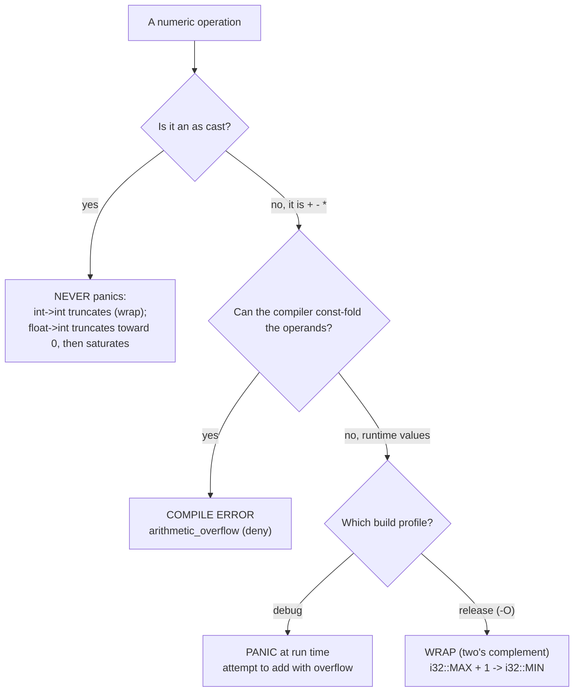

# Note · Numeric casts & integer overflow (`as`, debug vs release)

*Concept companion for [`03_scalar_types.rs`](03_scalar_types.rs) — "why didn't my overflow break?" · indexed in the [Rust Notebook](../Notebook.md) under "Concept notes".*

## TL;DR
Two surprises hide in numeric code. **(1)** An `as` cast is deliberately lossy and **never panics** — int→int truncates (two's-complement wrap), float→int truncates *toward zero* then *saturates* to the target's range (`NaN` → `0`). **(2)** Arithmetic (`+ - *`) overflow has a split personality: the compiler **opportunistically** rejects overflows it can const-fold (`arithmetic_overflow`, a deny-by-default lint), otherwise it's a **runtime** decision — **debug panics, release wraps**. When you actually want defined overflow behaviour, reach for `checked_/wrapping_/saturating_/overflowing_`.

## Decision tree — what happens on a numeric op?

The compile-time catch is **best-effort**: it only fires when const-propagation can fold the operands to constants. Something as small as printing the value first can defeat the folding — which is exactly why `03_scalar_types.rs` *compiles* and then panics, instead of failing to compile.

## Overflow on `+ - *` — the matrix (verified, rustc 1.96)
| Code shape | debug | release (`-O`) |
| --- | --- | --- |
| Operands the compiler can fold — `i32::MAX + 1`, or `let m = i32::MAX; let o = m + 1;` with **no use in between** | **compile error** | **compile error** |
| Operands it can't fold — a runtime value, or a binding **used first** (ex03: `println!("{i32_max}")` *before* `+ 1`) | **runtime panic** | **wraps** (`-2147483648`) |

## `as` casts — always defined, never a panic (verified)
| Cast | Rule | Examples |
| --- | --- | --- |
| int → int | keep the low N bits = two's-complement wrap (mod 2ᴺ) | `300i32 as u8` → `44` · `-1i32 as u8` → `255` |
| float → int | truncate **toward zero**, then **saturate** to range; `NaN` → `0` | `3.9 as i32` → `3` · `-3.9 as i32` → `-3` · `1e20 as i32` → `2147483647` · `NaN as i32` → `0` |
| int → `char` | **only `u8 as char`** is legal (other int types are rejected — use `char::from_u32`) | `82u8 as char` → `'R'` (the ex03 decoder!) |
| int → float | nearest representable value (may lose precision) | `16_777_217i32 as f32` is rounded |

Need a *checked* conversion instead of a silent one? Use `TryFrom`/`try_into`: `u8::try_from(300)` returns `Err(...)`.

## When you mean to overflow — be explicit
| Method (also `_sub`, `_mul`, …) | On overflow | Returns |
| --- | --- | --- |
| `a.checked_add(b)` | the safe one | `Option<T>` — `None` if it overflowed |
| `a.wrapping_add(b)` | two's-complement wrap | `T` |
| `a.saturating_add(b)` | clamp to `MIN`/`MAX` | `T` |
| `a.overflowing_add(b)` | wrap **and** tell you | `(T, bool)` |

## Analogies
| Topic | Rust | C# (tier 1) | C / Python (tier 2) |
| --- | --- | --- | --- |
| runtime overflow | **debug panics**, release wraps | **`unchecked` (the default): wraps**; `checked { … }` throws `OverflowException` | C: signed = UB, unsigned wraps · Python: ints are arbitrary-precision → no overflow |
| compile-time constant overflow | **compile error** | compile error | C: silently wraps / UB · Python: n/a |
| float → int | `as`: toward zero + saturate | `(int)3.9` → `3` (toward zero) | C: `(int)3.9` → `3` · Python: `int(3.9)` → `3` |

The tidy tier-1 mapping: **Rust debug ≈ C# `checked`**, **Rust release ≈ C# `unchecked`** (C#'s default). Rust just flips which one you get by build profile, and makes you *opt in* to wrapping with method names so it's visible at the call site.

## See also
- Reference — type cast (`as`) expressions — https://doc.rust-lang.org/reference/expressions/operator-expr.html#type-cast-expressions
- Reference — overflow behaviour — https://doc.rust-lang.org/reference/expressions/operator-expr.html#overflow
- `i32::checked_add` & the wrapping/saturating/overflowing family — https://doc.rust-lang.org/std/primitive.i32.html#method.checked_add
- The Rust Book, ch. 3.2 "Data Types" — https://doc.rust-lang.org/book/ch03-02-data-types.html
