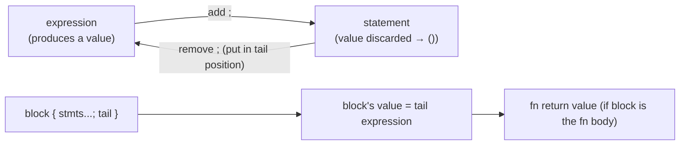

# Functions, and the expression-vs-statement rule

> Concept note · pairs with [`04_functions.rs`](04_functions.rs) · deep-dive sibling: [conditional_returns](../playground/conditional_returns_notes.md)

## TL;DR
A function returns the value of its **tail expression** — the last thing in the block *with no `;`*. That works because Rust is **expression-oriented**: blocks, `if`, `match`, and `{ … }` all *produce values*. The `;` is not just punctuation — it **discards** an expression's value, turning it into a **statement** (which yields `()`, the unit type). So `n * n` returns the product, but `n * n;` returns nothing. `return x;` is the *separate*, explicit early-exit tool (a statement, anywhere in the body).

## Picture it


## Why it works this way
| Form | Is it… | Value | Notes |
| --- | --- | --- | --- |
| `n * n` | expression | the product | put it last (no `;`) ⇒ it's the return value |
| `n * n;` | **statement** | `()` | the `;` throws the value away |
| `let s = …;` | statement (a `let` binding) | `()` | its right-hand side is an expression |
| `return n * n;` | statement | — (diverges) | explicit early exit; works anywhere, not just the tail |
| `if c { a } else { b }` | expression | `a` or `b` | both arms must be the **same** type |
| `{ let a = 2; a + 1 }` | expression (block) | `3` | a block is an expression; its tail is its value |

Two consequences worth burning in:
- **Adding `;` to a function's last line changes its return type to `()`** — and if the signature says `-> i32`, that's `E0308` (mismatched types: expected `i32`, found `()`).
- **A block bound to a name yields `()` if its tail has a `;`** — so `let x = { let a = 2; a + 1; };` makes `x == ()`, and then `println!("{x}")` fails with `E0277` (`()` doesn't implement `Display`). *(This is exactly what task 4 asks you to provoke.)*

## Tiered analogy
| Tier | Language | Returning a value |
| --- | --- | --- |
| 1 | **C#** | always explicit: `return n * n;` (or expression-body `int Square(int n) => n * n;`). No "tail expression" concept — a bare `n * n` line is illegal. |
| 2 | **C** | always explicit `return n * n;`. |
| 2 | **Python** | always explicit `return n * n` (no value ⇒ `None`, Rust's analogue of `()`). |
| — | **Rust** | tail expression is the *default*; `return` is the exception (early exit). |

## ⚠️ Gotcha caught in review — "assign on every iteration" returns the last item
A loop that updates an accumulator **unconditionally** keeps the *last* value, not the one you wanted:
```rust
for c in s.chars() {
    if i < n { i += 1; }
    nth = c;        // <-- runs every pass ⇒ nth ends as the LAST char
}
```
Gate the capture (or exit early). But beware a **subtler second version** of the same bug — capture conditionally, yet advance the counter only in the `else`:
```rust
for c in s.chars() {
    if i == n { nth = c; } else { i += 1; }   // i FREEZES at n ⇒ STILL the last char
}
```
The position counter must advance on **every** iteration. Tying `i += 1` to "haven't matched yet" stalls it the instant matching starts, so `i` stays `== n` and every remaining char overwrites the capture. Fix it by incrementing unconditionally and `break`-ing on the match — or better, drop the manual counter and let `.enumerate()` own the index:
```rust
fn nth_char(s: &str, n: usize) -> char {
    for (i, c) in s.chars().enumerate() {
        if i == n { return c; }   // capture exactly the one you want
    }
    ' '                            // tail: fallback when n is out of range
}
```
This drops the manual `mut i` counter entirely — fewer moving parts, no off-by-one.

## See also
- The "two conditional returns" question this exercise sparked: [conditional_returns.rs](../playground/conditional_returns.rs) · [notes](../playground/conditional_returns_notes.md)
- Next: [`05_control_flow.rs`](05_control_flow.rs) — `if`/`else` *as an expression* (the value form you previewed in `parity`).
