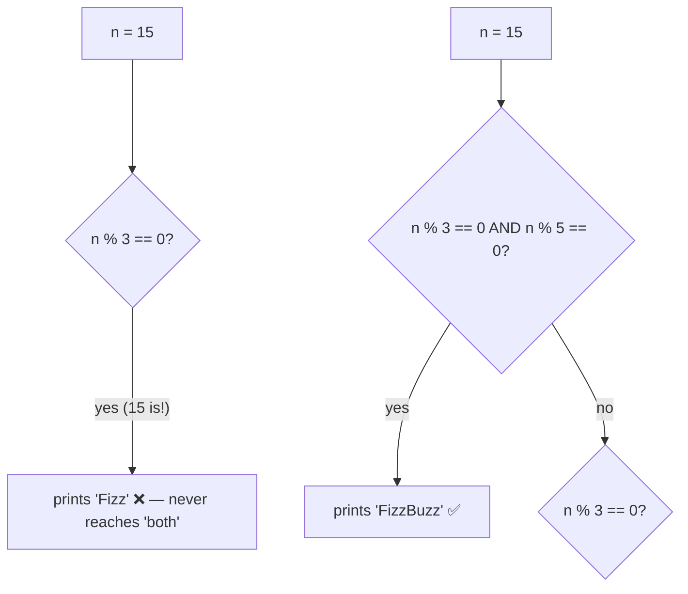

# Control flow as an expression — `if` values, bool-only conditions, and FizzBuzz order

> Concept note · pairs with [`05_control_flow.rs`](05_control_flow.rs) · builds on [04 functions](04_functions_notes.md) & [conditional_returns](../playground/conditional_returns_notes.md)

## TL;DR
`if` in Rust is an **expression**, so `let y = if c { a } else { b };` replaces the ternary you'd reach for in C#/C — which is *why Rust ships no `?:` operator at all* (it would be redundant). Two rules keep it honest: the condition must be a **real `bool`** (no "truthy" ints — `if 1 {}` is a compile error), and when used as a value **all arms must be the same type** (so the binding has one known type at compile time). Bonus lesson from the FizzBuzz side quest: when conditions overlap, **test the most specific case first**.

## The FizzBuzz ordering trap
"Fizz" if ÷3, "Buzz" if ÷5, "FizzBuzz" if **both** — for `n = 15` the answer is `FizzBuzz`. But check `÷3` first and 15 matches immediately:

The combined condition is **stricter** than either single one, so it must come **first** in the `else if` ladder — otherwise a broader branch swallows the input before the specific one is reached. Correct order:
```rust
if n % 15 == 0      { print!("FizzBuzz"); }   // both — most specific, goes first
else if n % 3 == 0  { print!("Fizz"); }
else if n % 5 == 0  { print!("Buzz"); }
else                { print!("{n}"); }
```
(`n % 15 == 0` ≡ `n % 3 == 0 && n % 5 == 0`.) General rule for any `if/else if` chain: **order branches specific → general**, because the *first* true arm wins.

## Two compiler guarantees (verified in the exercise)
| You wrote | Verdict | Why |
| --- | --- | --- |
| `if n % 2 == 0 { "even" } else { 0 }` | `E0308` mismatched types (`&str` vs `i32`) | a value-`if`'s arms must unify to one type, so the binding has a single compile-time type |
| `if 1 { … }` | `E0308` mismatched types (`bool` vs `i32`) | conditions are **strictly `bool`** — Rust has no integer "truthiness" |

## Tiered analogy
| Tier | Language | Conditional value | "truthy" non-bools? |
| --- | --- | --- | --- |
| 1 | **C#** | ternary `c ? a : b` (or `switch` expr); `if` is a statement | no (must be `bool`) — like Rust |
| 2 | **C** | ternary `c ? a : b` | **yes** — any non-zero int is true |
| 2 | **Python** | `a if cond else b` | **yes** — truthiness everywhere (`0`, `""`, `[]` are false) |
| — | **Rust** | `if c { a } else { b }` is itself the value — *no ternary needed* | **no** — condition must be exactly `bool` |

So the two "questions to ponder" answer each other: Rust omits `?:` **because** `if` is already an expression, and it demands same-typed arms + a real `bool` so the value's type is known at compile time with zero implicit coercion.

## See also
- Tail-expression mechanics behind "if as a value": [04_functions_notes.md](04_functions_notes.md) · [conditional_returns](../playground/conditional_returns_notes.md)
- Next: [`06_loops.rs`](06_loops.rs) — you'll wrap this FizzBuzz decision in `1..=15`.
