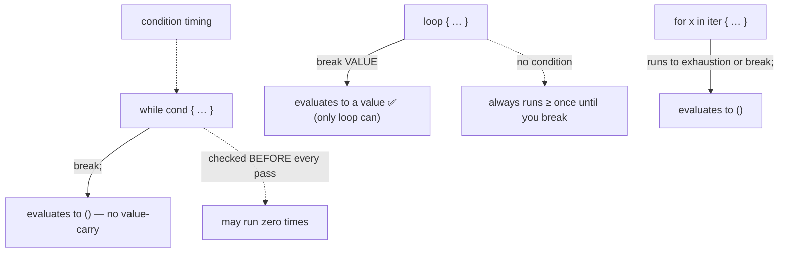

# Loops — `loop` / `while` / `for`, break-with-value, ranges & labels

> Concept note · pairs with [`06_loops.rs`](06_loops.rs) · builds on [05 control flow](05_control_flow_notes.md)

## TL;DR
Three loop forms, each with a job: **`loop`** is the infinite one you exit with `break` — and *only* `loop` can **carry a value out** via `break value`; **`while cond`** runs while a real `bool` holds (check-before-each-pass); **`for x in iter`** walks any iterator, most often a **range** (`0..n` end-exclusive, `0..=n` inclusive). Rust's `for` is `foreach`-only — there is **no** C-style `for(i=0; i<n; i++)`, which is *why* it can't run off the end. Two gotchas this exercise surfaced: looping FizzBuzz needs the **`else if` ladder** (independent `if`s double-fire on 15), and a loop **label** you never `break`/`continue` to is a dead `unused_labels` warning.

## The loop family


| Form | Condition? | `break value`? | Reach for it when… |
| --- | --- | --- | --- |
| `loop` | none | **yes** | you'll exit from *inside* (search/retry) and maybe return a result |
| `while c` | before each pass | no | a bool gate decides continuation *up front* (may run 0×) |
| `for x in it` | driven by iterator | no | walking a known sequence/range/collection |

## Two things this exercise taught
**1) Looped FizzBuzz must use `else if` — not three independent `if`s.** Your `05` version got this right; the `06` loop reverted to:
```rust
if o % 15 == 0 { println!("FizzBuzz"); }
if o % 3 == 0  { println!("Fizz"); }      // ⚠️ independent — also fires on 15
if o % 5 == 0  { println!("Buzz"); }      // ⚠️ and so does this
```
So `o = 15` prints **three lines** (`FizzBuzz`, `Fizz`, `Buzz`), and non-multiples (1, 2, 4, …) print **nothing** (there's no `else`). Independent `if`s = "every true branch runs"; an `else if` ladder = "first true branch wins, then stop". Restore the ladder + an `else { println!("{o}"); }`:
```rust
if o % 15 == 0      { println!("FizzBuzz"); }
else if o % 3 == 0  { println!("Fizz"); }
else if o % 5 == 0  { println!("Buzz"); }
else                { println!("{o}"); }
```

**2) An unused label is a warning.** `'inner: loop { … break; }` never refers to `'inner`, so rustc emits `unused_labels`. Labels earn their keep only when an inner `break 'outer;` / `continue 'outer;` needs to target a specific enclosing loop. Drop the label or use it.

*(Tidy-up bonus: `Some(n_next).unwrap() == Some(mnext).unwrap()` is a wrap-then-unwrap round-trip that cancels out — `Some(x).unwrap()` is just `x`. Since `Option<T>` implements `==`, compare the options directly: `n_next == mnext`.)*

## Tiered analogy
| Tier | Language | `for` shape | Run off the end? |
| --- | --- | --- | --- |
| 1 | **C#** | `foreach (var x in xs)`; plus C-style `for(int i…; i<n; i++)` and `while`/`do-while` | C-style `for` can — you manage `i` by hand |
| 2 | **C** | only C-style `for(i=0; i<n; i++)` | easily — classic off-by-one bugs |
| 2 | **Python** | `for x in range(n)` (≈ Rust `0..n`) | no — range-driven, like Rust |
| — | **Rust** | `for x in 0..n` / `0..=n` — **no** manual counter | **no** — the iterator owns the bound |

So the "ponder" answers: `for i in 0..n` is **safer than C#'s manual `for`** because you never write the index arithmetic that causes off-by-one / overrun — the range *is* the bound. And reach for **`loop` over `while`** when the natural exit is *inside* the body (you don't have the condition until you've done some work, e.g. found a hit, or want `break value` to hand a result out).

## See also
- The FizzBuzz ordering rule (first-true-arm-wins): [05_control_flow_notes.md](05_control_flow_notes.md)
- Next: [`07_tuples_arrays.rs`](07_tuples_arrays.rs) — fixed-size compound types; `for` finally walks a real array.
