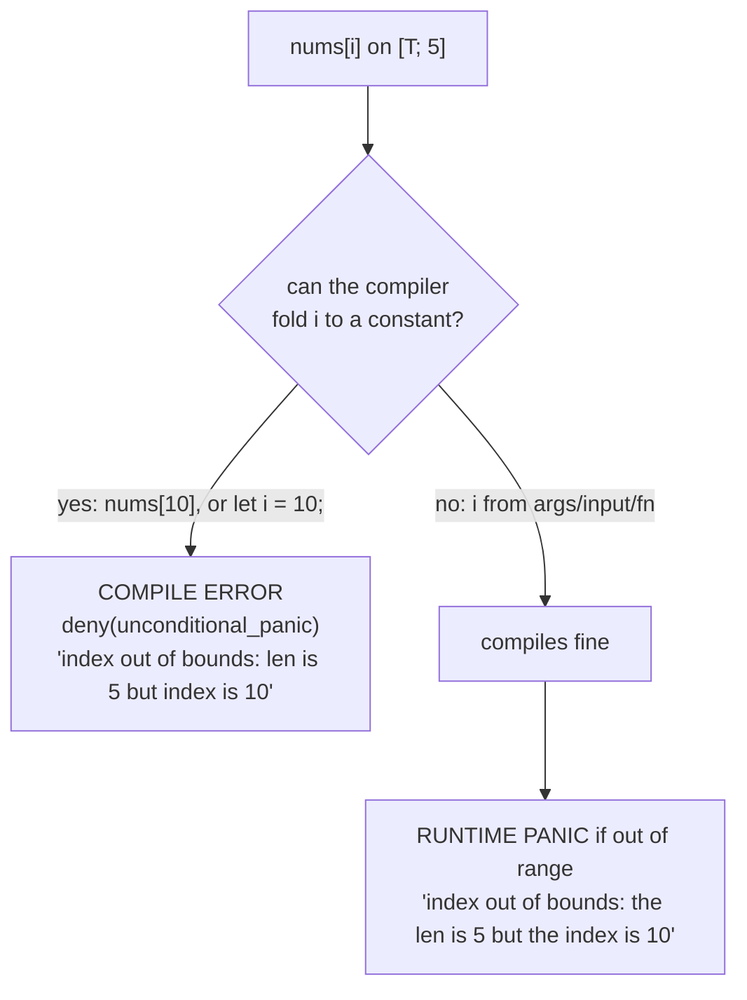

# Tuples & arrays — fixed-size compounds, and bounds: compile-time vs runtime

> Concept note · pairs with [`07_tuples_arrays.rs`](07_tuples_arrays.rs) · callback to [03 overflow](03_scalar_types_notes.md)

## TL;DR
Two **fixed-size** compound types. A **tuple** `(T1, T2, …)` groups a fixed number of *possibly-different* types — access by position `t.0` or **destructure** `let (a, b, c) = t;`. An **array** `[T; N]` is `N` values of the *same* type — index `a[i]`, length `a.len()`. Both sizes are fixed at **compile time**, which is what lets Rust catch some out-of-bounds reads *before the program runs*. The headline lesson (a direct echo of ex03's overflow story): **`nums[10]` on a 5-element array is a compile error when the index is const-foldable, but a runtime panic when the index is genuinely dynamic.**

## Bounds checking: when does it fire?

Verified with `rustc`:

| Index expression | Verdict | Mechanism |
| --- | --- | --- |
| `nums[10]` (literal) | **compile error** | `unconditional_panic` lint (deny-by-default) |
| `let i = 10; nums[i]` | **compile error** | rustc const-propagates `i` ⇒ still foldable |
| `let i = args().count()+9; nums[i]` | compiles, then **runtime panic** | value unknown at compile time |

So your comment — *"compiler failed with: this operation will panic at runtime"* — is exactly right for the **constant** case: rustc proves the panic is *unconditional* and refuses to build. Make the index runtime-derived and the very same message becomes an actual panic *at run time*. This is the **same opportunistic const-fold catch** you met with integer overflow in ex03: caught early when the compiler can see the values, deferred to runtime when it can't. Either way Rust never gives you C's silent out-of-bounds read.

## Tuple vs array — which when?
| | Tuple `(A, B, C)` | Array `[T; N]` |
| --- | --- | --- |
| Element types | **mixed** | **all the same** |
| Access | `t.0`, `t.1` / destructure | `a[i]` (+ `.len()`, iterate) |
| Size | fixed, part of the type | fixed `N`, part of the type |
| Use when | a small **record** of related-but-different fields (e.g. `(id, ratio, tag)`) | a **run** of uniform values you index/iterate |

## Tiered analogy
| Tier | Tuple | Array |
| --- | --- | --- |
| 1 · **C#** | `ValueTuple` `(int, string) t = (1, "a");` — `t.Item1` / destructure | `int[] a = {1,2,3};` (heap, length known at runtime) — Rust's `[T; N]` is stack & size-in-type |
| 2 · **C** | `struct` (no first-class tuple) | `int a[5];` — but **no** bounds checks at all |
| 2 · **Python** | `(1, "a")` — heterogeneous, immutable | `list` — dynamic; closest fixed peer is `array`/`tuple` |
| — | bundle a fixed set of **mixed** values | a fixed run of **one** type |

So the "ponder" answers: choose a **tuple** for a few related values of *different* types (a lightweight record), an **array** for many values of the *same* type you'll index/iterate; and fixing both sizes at **compile time** buys (a) stack allocation with no heap bookkeeping, (b) the size baked into the type so signatures are explicit, and (c) the chance to **catch some out-of-bounds reads at compile time** (above).

## 🦀 Decoder payoff
The finale side quest indexes `scrambled` in `order` to spell the seven collected letters — it prints **`OXIDISE`**, completing Level 1. Indexing-as-permutation is the array concept doing real work.

## See also
- The same compile-time-vs-runtime catch for arithmetic: [03_scalar_types_notes.md](03_scalar_types_notes.md)
- Loops that walk these: [06_loops_notes.md](06_loops_notes.md)
- Next up: **Level 2 — Ownership & Borrowing** (`20_ownership/`); preview keeper [borrowing](../playground/borrowing_notes.md).
