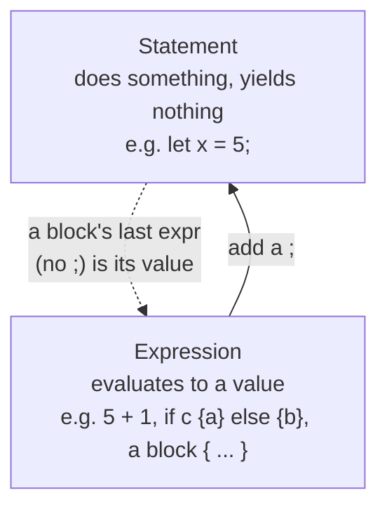

# Level 1 — Fundamentals

**Goal:** isolate *one* concept per exercise. These map closely to things you already
know from C#/C/Python, so the friction is low — the point is to get Rust's *syntax* and a
few of its early quirks into muscle memory before we hit ownership in Level 2.

## How to work through it
1. Open an exercise (e.g. `01_hello.rs`). Read the header comment — it states the concept,
   analogies, the task, and a few questions to ponder.
2. Write your solution inside `fn main()` (and any functions the task asks for).
3. **Explain your reasoning in comments** as you go. Mark questions with `// Q:` so I can
   find and answer them during review.
4. Compile & run, then tell me you're ready for review.

```powershell
# from inside Rust\10_fundamentals\
rustc 01_hello.rs        # produces 01_hello.exe
.\01_hello.exe           # run it
```

## Quick map: C# → Rust (Level 1 surface syntax)
| Idea | C# (tier 1) | Rust |
| --- | --- | --- |
| Print line | `Console.WriteLine($"{x}")` | `println!("{x}")` |
| Mutable local | `var x = 1;` (mutable) | `let mut x = 1;` |
| Immutable local | `readonly`/`const` | `let x = 1;` (default!) |
| Constant | `const int N = 5;` | `const N: i32 = 5;` |
| Function | `int Square(int n){ return n*n; }` | `fn square(n: i32) -> i32 { n * n }` |
| Conditional value | `var y = c ? a : b;` | `let y = if c { a } else { b };` |
| Foreach range | `for(int i=0;i<n;i++)` | `for i in 0..n { }` |
| Tuple | `(int, string) t = (1,"a");` | `let t: (i32, &str) = (1, "a");` |
| Array | `int[] a = {1,2,3};` | `let a: [i32; 3] = [1, 2, 3];` |

## The one big new idea this level: **expression vs statement**
Almost everything in Rust is an *expression* (it produces a value). A trailing line with
**no semicolon** is the value that "falls out" of a block. This is why `if` can be assigned
to a variable and why functions return without `return`.



> Tier 2 mirror — **C/Python:** in C a function needs `return`; in Rust the tail expression
> *is* the return. Python's `if/else` is a statement, but Rust's `if` is an expression like
> Python's `a if cond else b`.

When you're done with all seven boxes in `Sequence.md`, we graduate to **Level 2: ownership
& borrowing** — the part with no C# equivalent, where we slow down and draw pictures.
