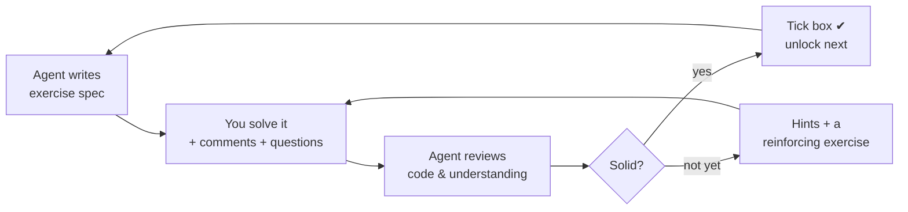

# Rust Exercise Sequence

The ordered ladder of exercises for learning Rust. We climb it one rung at a time: **isolate a concept → mix a few → mix more → build small apps**.

## How to use this file
- Each exercise is a single `.rs` file in a numbered level folder (e.g. `10_fundamentals/01_hello.rs`).
- I (the agent) drop in an exercise **spec** (a skeleton with the task in comments — *not* a solution).
- You write the solution **and explain your understanding in comments**, plus any questions.
- I review your code *and* your comments, correct misconceptions, then tick the box and unlock the next.

### Checkbox legend
- `[ ]` not started   ·   `[~]` in progress / awaiting review   ·   `[x]` done & reviewed

### The loop

### Naming & numbering (so we never have to renumber)
- **Folder prefix = level (difficulty tier), decade-gapped:** Level N → `(N×10)_theme/` → `10_fundamentals/`, `20_ownership/`, `30_types_match/`, `40_collections_generics/`, `50_cli_apps/`. Reserved gaps (`15_`, `25_`, …) let us wedge a new tier between two existing ones without touching either.
- **Files within a level stay tight** (`01_`, `02_`, …) — renumbering a few files inside one folder is cheap and local; a half-step name like `03b_` works in a pinch.
- **Advanced revisits go to the tier where the difficulty belongs** (usually appended as a higher level), *not* cloned into an early folder. Same folder = same tier + theme.
- **This file is the source of truth for ORDER.** Filenames are stable IDs (like C# class names); to reorder, edit the lists below — don't rename files.

---

## Level 1 — Fundamentals *(isolate one concept each)*
Familiar-from-other-languages syntax; low friction, build confidence.

- [x] `10_fundamentals/01_hello.rs` — printing & format args (`println!`, placeholders)
- [x] `10_fundamentals/02_variables.rs` — `let`, `mut`, shadowing, `const`
- [x] `10_fundamentals/03_scalar_types.rs` — integers/floats/`bool`/`char`, casting with `as`
- [x] `10_fundamentals/04_functions.rs` — params, return types, **expression vs statement**
- [x] `10_fundamentals/05_control_flow.rs` — `if`/`else` as an **expression**
- [ ] `10_fundamentals/06_loops.rs` — `loop` (break-with-value), `while`, `for` + ranges
- [ ] `10_fundamentals/07_tuples_arrays.rs` — tuples (destructuring), arrays (index, `len`)

## Level 2 — Ownership & Borrowing *(isolated — Rust's signature idea)*
The concepts that make Rust *Rust*. No analogy in C#/Python; we go slow with diagrams.

- [ ] `20_ownership/01_ownership_move.rs` — move vs `Copy`, stack vs heap, `String`
- [ ] `20_ownership/02_references_borrow.rs` — `&T`, `&mut T`, the borrow rules
- [ ] `20_ownership/03_slices.rs` — `&str` and array slices
- [ ] `20_ownership/04_string_vs_str.rs` — owned `String` vs borrowed `&str`

## Level 3 — Custom Types & Pattern Matching *(start mixing)*
Model your own data; combine it with ownership.

- [ ] `30_types_match/01_structs.rs` — fields, `impl`, methods
- [ ] `30_types_match/02_enums.rs` — data-carrying variants
- [ ] `30_types_match/03_match.rs` — exhaustiveness, binding, guards
- [ ] `30_types_match/04_option.rs` — `Option<T>`, `if let`, no nulls
- [ ] `30_types_match/05_result.rs` — `Result<T, E>`, the `?` operator

## Level 4 — Collections, Generics, Traits, Errors *(more mixing)*
- [ ] `40_collections_generics/01_vectors.rs` — `Vec<T>`
- [ ] `40_collections_generics/02_hashmaps.rs` — `HashMap<K, V>`
- [ ] `40_collections_generics/03_iterators_closures.rs` — `map`/`filter`/`collect`, closures
- [ ] `40_collections_generics/04_generics.rs` — generic fns & structs
- [ ] `40_collections_generics/05_traits.rs` — define/`impl`, trait bounds, `derive`
- [ ] `40_collections_generics/06_lifetimes.rs` — explicit lifetime annotations
- [ ] `40_collections_generics/07_error_handling.rs` — custom errors, `?` propagation

## Level 5 — Simple CLI Apps *(integration)*
Tie everything together in tiny programs.

- [ ] `50_cli_apps/01_greeter.rs` — args (`std::env::args`) + stdin
- [ ] `50_cli_apps/02_calculator.rs` — parse input + error handling
- [ ] `50_cli_apps/03_word_count.rs` — read a file + count with `HashMap`
- [ ] `50_cli_apps/04_todo_cli.rs` — structs + `Vec` + file persistence
- [ ] **Milestone:** graduate to **Cargo** for `05_guessing_game` (needs the `rand` crate)

## Beyond *(tracked in `TODO.md`, sequenced later)*
Modules & crate layout · `#[test]` testing · smart pointers (`Box`/`Rc`/`RefCell`) · error crates (`anyhow`/`thiserror`) · traits deep-dive · concurrency (threads, channels) · `async`/`await`.
