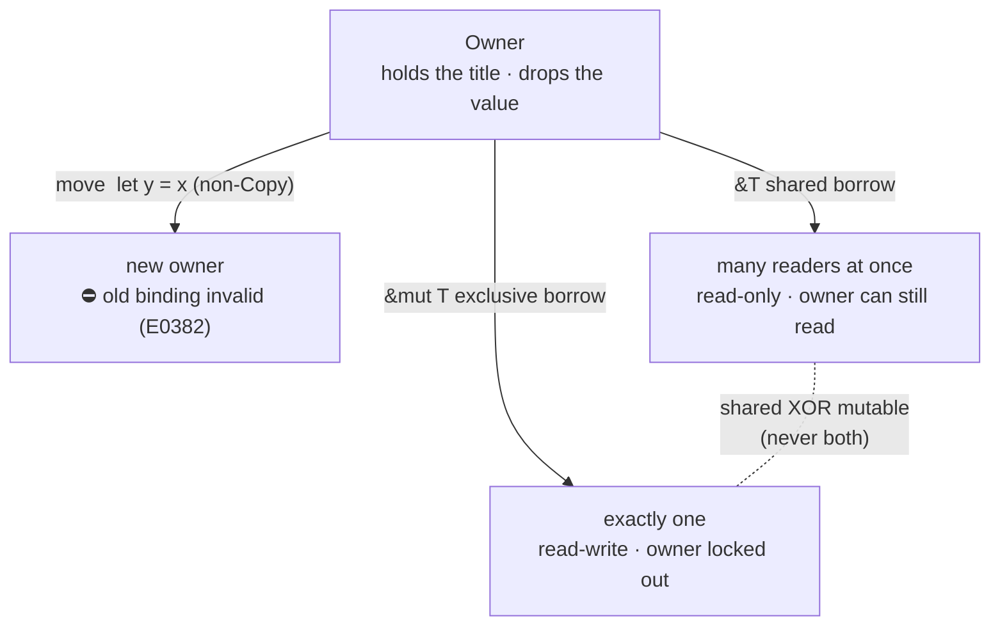

# Borrowing — "borrow" vs "share" vs "move"

Pairs with [`borrowing.rs`](borrowing.rs) (playground; ahead-of-curriculum). Run it, then try the **Fun Zone** challenges at the bottom of that file.

## The reframe
Your car analogy works — once you map it to the right operation:

| Operation | Car analogy | Effect on the original binding |
| --- | --- | --- |
| **Move** (`let y = x`, non-`Copy`) | give / sell the car away | ⛔ invalid — *"borrow of moved value"* (E0382) |
| **Shared borrow** `&T` | let people *read* it; you can too | ✅ stays valid, read-only while lent |
| **Exclusive borrow** `&mut T` | lend the car to drive | ✅ valid again *after* — but **locked out** *during* |

"Share" only describes `&T`. `&mut T` is the **opposite** of shared (it is exclusive). The umbrella word for *temporary, non-owning, must-return* access is **borrow** — which is why both `&` and `&mut` are "borrows", not "shares".

## The one rule: aliasing XOR mutability
At any instant: **either** one `&mut T` **xor** any number of `&T` — and no borrow may outlive its owner.

## Tiers
- **C# (1):** `&T` ≈ `in` (readonly ref); `&mut T` ≈ `ref`. The rule is a compile-time `ReaderWriterLock` — many readers **xor** one writer. *Move* has no real equivalent (references just alias; the GC cleans up).
- **C (2):** `&T` ≈ `const T*`; `&mut T` ≈ `T* restrict` — the no-alias promise you make by hand in C, which Rust proves for you. *Move* ≈ pass the pointer and `NULL` the old one.
- **Python (2):** every name is a shared, freely-mutable reference — exactly the *mutate-while-iterating* footgun that Rust turns into a compile error.

## Why the scalar exercises never showed this
`i32`, `bool`, `char`, `f64`, … are **`Copy`**: `let b = a` duplicates the value, so there's no move and both bindings stay valid. `String`, `Vec<T>`, and most owning types are **not `Copy`**: assignment **moves** them. That's why the numbers in `03_scalar_types.rs` behaved "normally" — they were quietly copied.

---

## Answer key (spoilers — do the Fun Zone challenges first!)
Decoded from the ROT13/ROT5 key in `borrowing.rs`:

| Try | Error |
| --- | --- |
| mutate while `&` is live | `E0506` cannot assign to `x` because it is borrowed |
| read while `&mut` is live | `E0502` cannot borrow … as immutable … also borrowed as mutable |
| two `&mut` at once | `E0499` cannot borrow … as mutable more than once at a time |
| use after move | `E0382` borrow of moved value |
| borrow outlives owner | `E0597` … does not live long enough |
