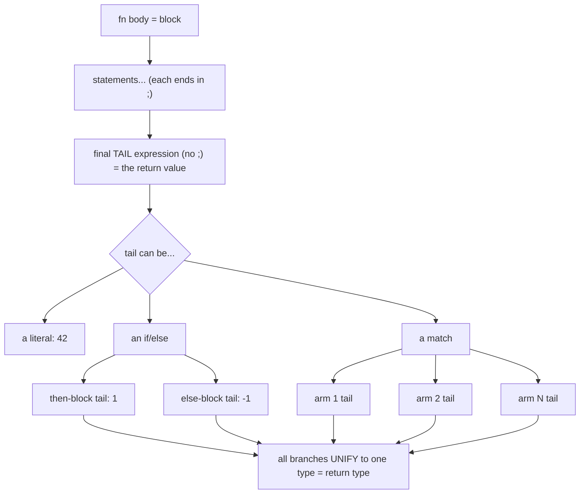

# Conditional value returns — one tail expression, not "two returns"

> Playground deep-dive · pairs with [`conditional_returns.rs`](conditional_returns.rs) · previews `04_functions` & `05_control_flow`

## TL;DR
"Can a function have **two conditional returns** without a `;`?" — Yes, but it isn't two returns. It's **one tail expression** (an `if/else` or a `match`) whose branches each sit in **tail position**. A block's value is its last expression *with no `;`*; because `if`/`match` are **expressions**, each branch's bare tail becomes the value the whole thing evaluates to — which becomes the function's return value. Three rules follow: every branch must be the **same type**, an `if`-as-value **needs an `else`**, and `return x;` is a *separate* mechanism (an explicit early return that **is** a statement, so it keeps its `;`).

## Picture it

The branch values aren't "multiple returns" — they're **candidate values for the single tail slot**. The compiler picks one at runtime, but type-checks that they could *all* fit that one slot.

## Why it works this way
Rust is **expression-oriented**: nearly every construct produces a value. So `if`/`match` don't merely *choose what to do* — they can *be the value*. That's why:

- **No `;` on a branch tail** = "this is the value of the branch" (add a `;` and you'd throw the value away, making the branch `()`).
- **All arms must agree on type** — the tail slot has exactly one type (the return type), so every branch must be able to fill it. Disagree → `E0308`.
- **`if` without `else`, used as a value** — the missing path would yield `()`, which can't fill an `i32` slot → `E0317`.
- **`return` is the escape hatch** — an explicit, early exit. It's a *statement* (takes `;`) and works anywhere, unlike the implicit tail. Use it for guard clauses; use the tail for the "normal" value.

## Tiered analogy
| Tier | Language | "if as a value?" | Idiomatic shape |
| --- | --- | --- | --- |
| 1 | **C#** | ❌ `if` is a **statement** | ternary `cond ? a : b`, `switch` expression `x switch { … }` (C# 8+), or explicit `return` |
| 2 | **C** | ❌ statement | ternary `cond ? a : b` |
| 2 | **Python** | ❌ statement | conditional expression `a if cond else b` (`match` exists 3.10+ but is a statement) |
| — | **Rust** | ✅ `if`/`match` **are expressions** | `if c { a } else { b }`, `match x { … }` — branch tails have no `;` |

Mapping: Rust `if/else`-as-value ≈ C# `?:`; Rust `match` ≈ C# `switch` **expression**. The mental flip from C#/C/Python is "control flow *is* the value," not "control flow *picks* a value to assign."

## Verified compiler checks (what breaks, and why)
| # | Snippet (shape) | Verdict | Code | Lesson |
| --- | --- | --- | --- | --- |
| ✅ | `if x>=0 { 1 } else { -1 }` | compiles | — | two arms, one tail, same type |
| ✅ | `match x { 0=>"zero", n if n>0=>"pos", _=>"neg" }` | compiles | — | N arms generalise "two" |
| ✅ | early `return "neg";` then tail `if/else` | compiles | — | statement + tail mix |
| ❌ | `if b { 1 } else { "no" }` (→ `i32`) | error | `E0308` | arms must unify to one type |
| ❌ | `if b { 1 }` (→ `i32`, no else) | error | `E0317` | value-`if` needs an `else` |

## See also
- Runnable demo + What-Breaks Zone: [`conditional_returns.rs`](conditional_returns.rs)
- Sibling playground keeper: [`borrowing.rs`](borrowing.rs) · [`borrowing_notes.md`](borrowing_notes.md)
- Coming up in the Sequence: `04_functions.rs` (expression vs statement) and `05_control_flow.rs` (`if`/`match` as expressions).

<details>
<summary>🔑 Answer key — exact errors for the What-Breaks Zone (spoilers)</summary>

```text
W1)  fn f(b: bool) -> i32 { if b { 1 } else { "no" } }
     error[E0308]: mismatched types
       expected `i32`, found `&str`   (expected because of the return type)
     → Fix: make both arms the same type, e.g. else { -1 }.

W2)  fn g(b: bool) -> i32 { if b { 1 } }
     error[E0317]: `if` may be missing an `else` clause
       expected `i32`, found `()`
       help: consider adding an `else` block that evaluates to the expected type
     → Fix: add an else arm that yields an i32 (the "didn't happen" path needs a value too).
```
</details>
