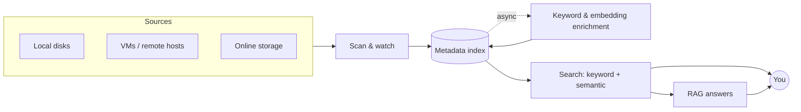

# pandex — Architecture overview

**Status:** under active design (M0). Nothing here is final. This file is the single source of truth for *decisions*; see [`../PLAN.md`](../PLAN.md) for the work order.

## The problem in one breath
Data files are scattered across many devices and stores, and no tool sees *across* them or understands their *content*. pandex scans every source, unifies what it finds into one versioned index, and lets you search it by name, metadata, keyword, and meaning.

## The pipeline at a glance
This shape is deliberately design-neutral — *where* each stage runs and *which* engine or model powers it are still open (see below).



## Goals
- One index across many sources; metadata for everything, content understanding opt-in.
- Cheap to keep current via surgical re-scans, not full rebuilds.
- Runs across operating systems; heavy work prefers device-usage troughs.
- Data and schema versioned from day one.

## Open decisions
The big forks. Each is settled below in the decision log with its rationale, worked in roughly this order (see [`../PLAN.md`](../PLAN.md)).

| # | Decision | Options being weighed | Status |
|---|----------|-----------------------|--------|
| 1 | Topology | single-machine · central aggregator · hub + agents | Open |
| 2 | Language | Rust (leaning) · other | Open |
| 3 | Index store | SQLite+FTS · sqlite-vec · Tantivy · LanceDB · server DB | Open |
| 4 | Index scope | metadata-only first · + keywords · + content embeddings | Open |
| 5 | LLM hosting | local/on-device · hosted API · hybrid | Open |
| 6 | Connectors | the pluggable Source interface | Open |
| 7 | Scheduling | usage-trough detection · async enrichment queue | Open |
| 8 | Versioning | data + schema migration strategy | Open |
| 9 | Observability | telemetry + benchmark harness | Open |
| 10 | Validation | fixtures + golden queries | Open |

## Architectural Decisions (log)
Each settled decision lands here — newest first — as **what**, **why**, **alternatives rejected**, and **date**. Prefer editing this log over appending duplicates; full history lives in git.

## How these docs are organized (a tree)
The docs form a tree whose **detail grows toward the leaves** — and the *independence* an implementer needs *shrinks* the deeper you go:

```text
docs/
  architecture.md          root — the whole system at a glance (this file)
  <area>/overview.md       branch — one subsystem's design, intent, and trade-offs
    <feature>/spec.md      leaf — one feature, fully specified, chunk by chunk
  decision-research/       option comparisons that feed the decision log
```

- **Top of the tree (high abstraction).** Enough context and intent that a high-capability model (e.g. Opus) can implement a whole area on its own, filling gaps with judgement.
- **Leaves (granular specs).** Each leaf pins one feature down precisely enough that a cheaper model (e.g. Haiku) can implement it mechanically, feature by feature, chunk by chunk.
- **Rule of thumb.** Push new detail *down* toward the leaves; keep parents as short, navigable summaries that link to their children, and don't duplicate detail up the tree.

Detailed concept notes will live beside this file under `docs/` and link from here as they are written. Option comparisons that feed decisions live under [`decision-research/`](decision-research/) (start from its `template.md`); a survey of similar tools and pandex's niche lives in [`decision-research/prior-art.md`](decision-research/prior-art.md).
